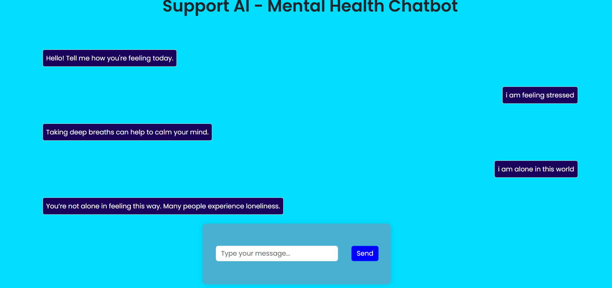

# 🧠 Mental Health Chatbot

🚀 **Mental Health Chatbot** is an intent-based conversational assistant designed to support users facing mental health challenges. The chatbot uses deep learning techniques with a Bag of Words model to classify user inputs and respond empathetically and appropriately.

💬 With an accuracy of **~87% on the test set**, this chatbot understands various user intents related to emotions, stress, anxiety, motivation, and more.

---

## 🌟 Features

- 🤖 **Intent Detection with Deep Learning** – Classifies user messages into predefined emotional or mental health categories.
- 💬 **Natural Conversations** – Provides helpful and comforting responses based on the user's intent.
- 📊 **~87% Test Accuracy** – Achieved using a simple yet effective neural network with Bag of Words text representation.
- 🧠 **Handles Multiple Mental Health Topics** – Stress, anxiety, motivation, sadness, loneliness, and more.
- 🌐 **Built with Flask** – Lightweight and easily deployable backend.
- ⚡ **Fast & Responsive UI** – Minimal and clean frontend for ease of use.

---

## 🛠️ Tech Stack

- **Frontend**: HTML, CSS
- **Backend**: Flask, Python
- **Machine Learning**: Deep Neural Network (Keras/TensorFlow)
- **Text Processing**: Bag of Words, Tokenization, Lemmatization

---

## 🧪 Model Details

- **Model Type**: Deep Neural Network (Sequential)
- **Input**: Processed text using Bag of Words
- **Output**: Intent class probabilities
- **Accuracy**: ~87% on test dataset
- **Training Data**: Custom JSON with intents, patterns, and responses

---

## 🚀 How to Run Locally

```bash
# Clone the repository
git clone https://github.com/rishabhpancholi/Intent-Based-Mental-Health-Chatbot-Using-Deep-Learning.git
cd Intent-Based-Mental-Health-Chatbot-Using-Deep-Learning

# Install dependencies
pip install -r requirements.txt

# Run the Flask app
python app.py
```
## 📷 Screenshots
 


## 🤝 Contributing
Feel free to open issues or contribute by submitting pull requests!

---
🌟 _If you like this project, don't forget to star the repository!_ ⭐
